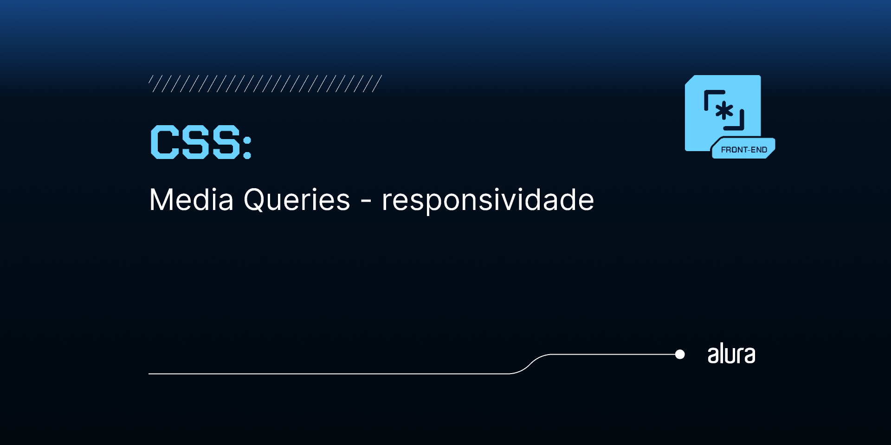

# Alura Start

A Alura Start faz parte do ecossistema Alura e é voltada para introduzir crianças e adolescentes ao mundo da tecnologia e programação de forma divertida e educativa. Através de projetos práticos, a plataforma ensina lógica de programação, pensamento computacional e habilidades digitais.

  
  
  

## 🔨 Funcionalidades do projeto

Neste estágio de desenvolvimento, o site possui as seguintes funcionalidades:

- Página estática com os principais planos, ofertas, serviços, parceiros e outras informações relevantes.

O [Figma dessa aplicação você encontra aqui](https://www.figma.com/community/file/1410337229734538357).

## ✔️ Técnicas e tecnologias utilizadas

O projeto utiliza as seguintes tecnologias e bibliotecas:

- `HTML` - Para estrutura e marcação dos elementos da página
- `CSS` - Para criação de folhas de estilo em cascata
- `Figma` - Para prototipagem do projeto

E outros...

## 🛠️ Abrir e rodar o projeto

Para executar o projeto em seu ambiente local, siga estas etapas:

1. Baixe o repositório do projeto.

1. Extraia os arquivos para uma pasta de sua preferência.

1. Navegue até a pasta em questão

1. Abra o arquivo `index.html` no seu navegador, iniciando assim o projeto localmente

## 📚 Mais informações do curso

Gostou do projeto e quer conhecer mais?

O design e protótipo deste projeto podem ser encontrados [aqui](https://www.figma.com/community/file/1410337229734538357). Este projeto é fictício e apenas reproduz o site original da Alura Start. 

Você pode visitar o site real da Alura Start e [conhecer as vantagens e os benefícios para sua escola acessando este link](https://www.alurastart.com.br/).

Aproveite o desenvolvimento e aprimoramento do site da Alura Start!

 

<h2> 📫 Como entrar em contato comigo 😄 <em>(Ele/Dele)</em></h2>

    
    
    

Isto é um projeto de estudos realizado na Alura. | Conheça mais sobre a _Alura_ por meio da minha [indicação!](https://www.alura.com.br/indica-dev/danilo-batista)
